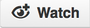

# BeerJS Panama City

Pintas.js es un evento mensual gratuito donde desarrolladores se reunen a tomar
pintas y hablar del mejor lenguaje del mundo: Javascript.

## Próximo Evento

* [Pintas.js #1](https://github.com/beerjs/pty/issues/1)

## Ediciones Pasadas

* No hay ediciones pasadas

## ¿Quieres unirte a la comunidad?

Dale click al botón  de este repo (y al de estrella
también, si gustas) para que te notifiquemos de las siguientes fechas y lugares
donde serán las reuniones.

## ¿Quieres ayudar?

Envia un Pull Request, Issue o edita el Wiki

## ¿Por qué Github?

* Github es una red social natural para desarrolladores.
* Menos spam
* Github es gratis y [Meetup.com
  no](http://www.meetup.com/help/Does-it-cost-money-to-start-a-Meetup-Group).

## Organizadores

* Ytzvan Mastino ([Github](https://github.com/ytzvan) /
  [Twitter](https://twitter.com/ytzvan))

